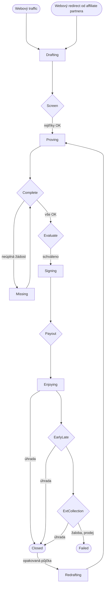

# Activity Diagram - zpracování žádosti/úvěru

## Průběh případu

- žadatel jde buď přímo přes webové stránky nebo žádost založí affiliate partner přes API a přesměruje žadatele do žádosti
- systém v ideálním případě pracuje zcela automaticky, bez operátorů
- stavy v průběhovém čase (-ing) jsou stavy, ve kterých se čeká na akci žadatele
- stavy v neutrálu (rozkazovací způsob, v "kosočtverci" ;-) jsou stavy, ve kterých se čeká na akci systému (v CRM oranžová barva) nebo operátora (červená)
- do Rejected stavu (není v grafu) se případ může dostat kdykoliv v průběhu žádosti (nejen při Screen), naopak nemůže při aktivní půjčce. Z Rejected stavu se může dostat zpět do žádosti, pokud pominul důvod zamítnutí
- do Missing stavu se dostává při chybě v dodaných dokumentech (špatně čitelná občanka, nečitelný výpis z účtu,...), zpět do Complete posouvá operátor
- během Payout se z případu žádosti stává případ úvěru
- během čerpání úvěru (Enjoying) může dočerpat do povoleného rámce, případně provést částečnou úhradu, případně si za poplatek posunout splatnost (prolongovat)
- opuštěné žádosti (tři dny bez aktivity) se automaticky zamítají
- po zamítnutí žádosti, pokud žádá znovu, tak se vytváří nový případ - opakovanoá žádost
- po doplacení může zažádat o tzv. opakovanou půjčku - založí se nový případ se zjednodušeným procesem žádosti

## Popis stavů případu

- Drafting - Zájemce vyplňuje formulář žádosti o půjčku
- Screen - Předběžné posoudit žádost (PRESCREEN)
- Proving - Nahrání dokumentace (občanka, výpisy,...)
- Missing - Něco nahrál, ale není to platný doklad/výpisy
- Complete - Něco nahrál, ověř občanku a případně mu zavolej
- Evaluate - Posoudit žádost (vč. upsell/downsell)
- Signing - Zobrazení a podepsání smlouvy
- Payout - Vyplatit půjčku
- Enjoying - Úvěr běží, čeká se na splatnost splátky
- EarlyLate - DPD0 az DPD35
- ExtCollection - DPD36 az DPD120
- Redrafting - Zájemce vyplňuje opakovanou žádost
- Rejected - Odmítnutý úvěr
- Failed - Odprodej/odpis nevymožené pohledávky
- Closed - Uzavřený případ

## Operace Loan modulu

- dotazování do rejstříků (různé v různých fázích)
- automatická detekce údajů z občanky
- spouštění decision engine
- tagování transakcí a identifikace příjmů
- zasílání _postback_ událostí o leadech partnerům
- vyplacení úvěru
- a další...

## Operace iSpis CRM

- automatické zasílání výzev ze šablon dle nastaveného spouštěče
- hlídání insolvencí
- komunikace s telefonní ústřednou
- zpracování příchozích plateb (distribuce transakcí)
- a další...

## Ruční zásahy operátorů

Systém v ideálním případě pracuje zcela automaticky, bez operátorů

- operátoři řeší netypické problémy
- pomáhají žadatelům vyplnit formulář
- ověřují občanky nebo výpisy z účtu, kde to nezvládl systém sám
- odpovídají na e-mailové dotazy
- volají na EarlyLate případy
- zajišťují další provozní záležitosti
