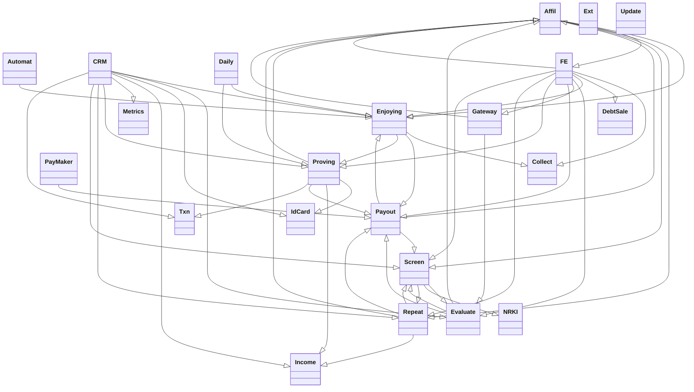

# Module Decoupling - rozbití Loan modulu na části

Aktuálně Loan API odpovídá na `/loan` (CRM) a `/fe` (front-end a zbytek)
routách, plus má nějaké `cmd*` funkce.

## 1. Logicky

TODO:

- core
- product
- web
- third
- crm

## 1b.

## 2. Rozdělení dle end-pointů

Jedna možnost je překopat to podle routes na následující:

- `/loan/core` - interní **Loan Core**, viz níž
- `/loan/affil` - API pro affily (původní `/fe/lead`)
- `/loan/web` - jenom webové funkce (původní `/fe`)
- `/loan/cron` - `cmd*` funkce volané automaticky, pravidelně
- `/loan/admin` - ostatní `cmd*` funkce, volané přes nějakou konzoli
- `/loan/testing` - "zkratky" pro testovací žádost (smazat, schválit,,...)
- `/loan/paymaker` - API pro platební roboty
- `/loan/bridge` - hooky pro CRM - co CRM modul nutně potřebuje volat
- `/loan/crm` - "tlačítka" v CRM pro operátory
- `/loan/gateway` - web-hooky (API) pro třetí strany

### 2.1. **Loan Core** (nástřel)

Dlouhodobý cíl, aby do DB přistupoval jen **Loan Core**.

Střednědobý cíl, abý zápis do DB prováděl jen **Loan Core**.

Krátkodobý cíl, mít v **Loan Core** funkce, které potřebuje víc modulů.

Zejména:

- založit žádost (pro affil i web)
- založit úkol při nějaké události (a "vyklikat" procesně předcházející)
- posunout žádost na další krok (při "Pokračovat", authFee, Kontomatiku,...)
- možná: vrátit kompletní informace o osobě/případu (pro dlouhodobý cíl)
- (funkce Config, Data, Project, Appl)

## 3. Rozdělení dle souborů

Druhý přístup je překopat `src/Loan/*.pm` soubory do více podadresářů:

- Core: Appl Config Project Repeat ScoreCard
- ?: Check Data Vars
- Process: Screen Complete Evaluate Payout
- ?: Proving Enjoying Collect DebtSale
- Routes: Affil CRM FE Gateway IS PayMaker
- Tests: TestDuo TestMTP Test TestSmoke TestWest
- Modules: IdCard Txn Income Ext
- Cron: Automat Daily NRKI Update
- Admin: Metrics Fix FixRecalc

### 3.2. Rozdělení dle statické analýzy zdrojáků

Třetí přístup je strojově zanalyzovat `src/Loan/*.pm` soubory a udělat
analýzu závislostí funkcí mezi sebou navzájem.

### 3.3. Závislosti mezi soubory navzájem

V grafu níž chybí závislosti na soubory:
`Project IS Config Complete ScoreCard Appl Check Data Vars`.

### 3.4. Závislosti mezi všemi soubory, včetně jmen funkcí

> Grafy byly vygenerovány pomocí `tool/analyze.pl`
