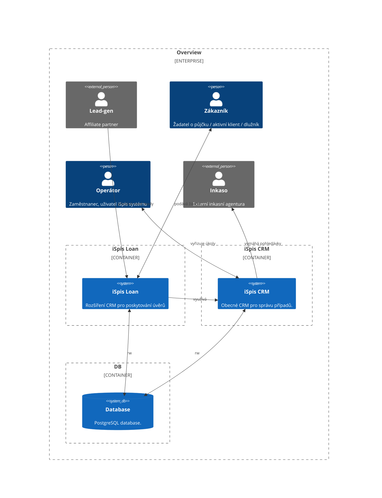
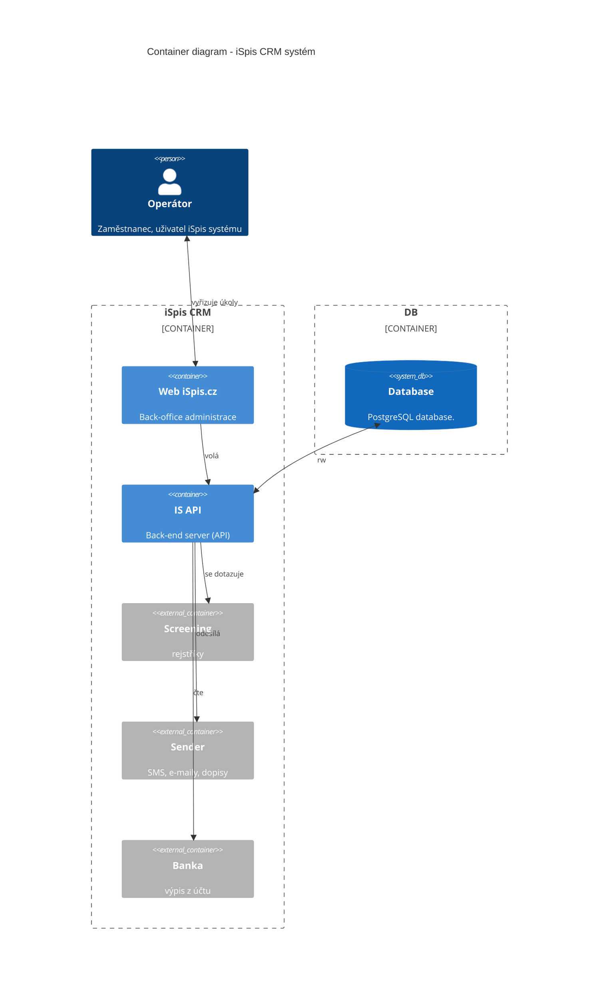
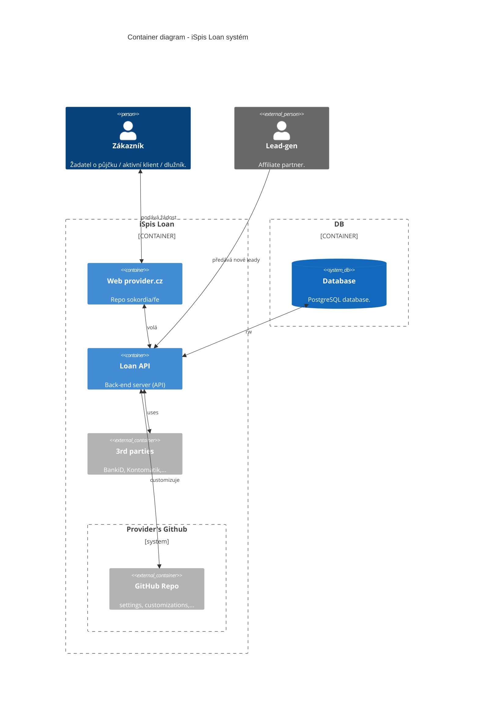
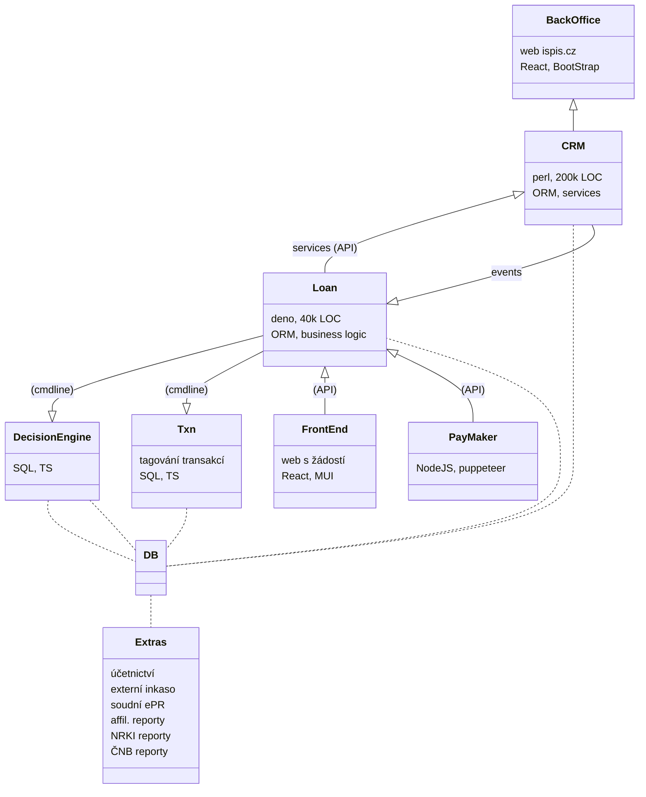

# System Architecture

> "Architecture is about the important stuff. Whatever that is" -Ralph Johnson

## 1. High-level přehled

### 1.1. System context

Systém se skládá z **iSpis CRM** - obecného CRM pro správu klientů
a jejich obchodních případů, a z **iSpis Loan** - rozšíření poskytující
funkcionalitu pro půjčování.

Oba moduly sdílejí stejnou databázi.

### 1.1.2. Systém **iSpis CRM**

**iSpis CRM** systém obsahuje aplikační server **IS API** běžící nad PostgreSQL
databází, poskytující API pro webový back-office [iSpis.cz](https://ispis.cz),
a taky API pro **iSpis Loan** modul.

Obsahuje funkcionalitu pro správu, vymáhání a soudní fázi zpracování pohledávek.

### 1.1.3. Systém **iSpis Loan**

**iSpis Loan** systém pak obsahuje webový front-end pro podávání žádosti
(v designu poskytovatele),
aplikační back-end **Loan API** a další pomocné služby a nástroje.

Při posuzování žádostí aplikační server používá DecisionEngine a nástroj
pro tagování transakcí, které můžou být dodané poskytovatelem.

### 1.1.3.1. **Loan API** modul

**Loan API** modul je aplikační server poskytující
API pro webový front-end, API pro affiliate partnery a další třetí strany,
část back-office, plus pomocné micro-services (PayMaker, reporting,...).

> Táto dokumentace se dále zabývá pouze **Loan API** modulem,
> případně jeho integrací na další části **iSpis Loan** systému.

Nebo-li - celkově se softwarové řešení skládá z **iSpis CRM** a **iSpis Loan**
systémů, kde **iSpis Loan** obsahuje front-end, back-end (modul **Loan API**),
plus pomocné nástroje. Tato dokumentace se zabývá pouze back-endem!

### 2. Technologie & deployment

Ústřední částí systému je PostgreSQL databáze, nad níž je řada modulů
v různých jazycích:

- **CRM** a **Loan** API back-end část je napsaná v Perlu
- **FrontEnd** je ReactJS aplikace (používající NextJS)
- **Extras** jsou napsané v SQL, R, TypeScript
- apod...

V tuto chvíli databáze i aplikační back-endy běží na jednom dedikovaném
Debian Linux serveru. Další služby běží na samostatných VS.
Databáze je v režimu hot-standby zálohovaná do sítě jiného ISP poskytovatele.

Důležité části **iSpis Loan** systému:

## 3. Repozitáře

Fakticky existuje několik repozitářů:

1. Sokordia **iSpis CRM** (firemní proprietární monorepo)
2. Sokordia iSpis **Loan API** modul -
   [github.com/sokordia/loan](https://github.com/sokordia/loan)
   (_TENTO REPOZITÁŘ_) - back-end microservice
3. Sokordia Loan **FrontEnd** modul (web pro podávání žádostí,
   v brandech/designech/grafikách jednotlivých poskytovatelů) -
   [github.com/sokordia/fe](https://github.com/sokordia/fe)
4. GitHub repozitář konkrétního poskytovatele, obsahující customizace
   (např. DecisionEngine, tagování transakcí, InboxLive, PayMaker,
   reporting skripty, nastavení,...)

Tento repozitář obsahuje pouze zdrojové kódy **Loan API** modulu.

Popis integrace **Loan API** modulu:

- na CRM viz [RepoCRM](RepoCRM.md)
- na FrontEnd viz [RepoFE](RepoFE.md)
- na repo poskytovatele viz [RepoProvider](RepoProvider.md).

## 4. Modul **Loan API**

**Loan API** modul (_TENTO REPOZITÁŘ_),
[github.com/sokordia/loan](https://github.com/sokordia/loan),
obsahuje zdrojové kódy aplikačního back-end serveru.

Seznam jednotlivých služeb (end-pointů) viz [APIServices](APIServices.md).
